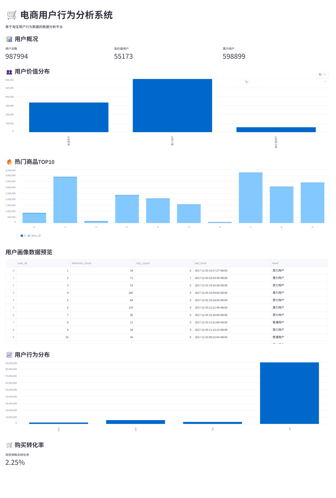
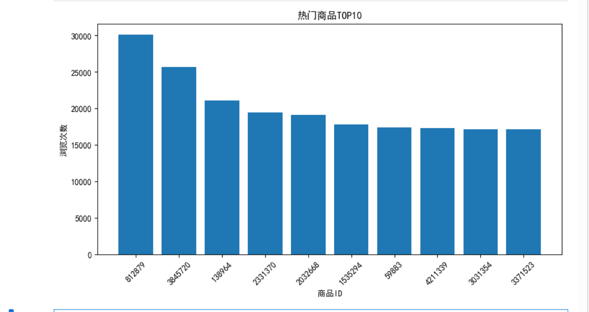
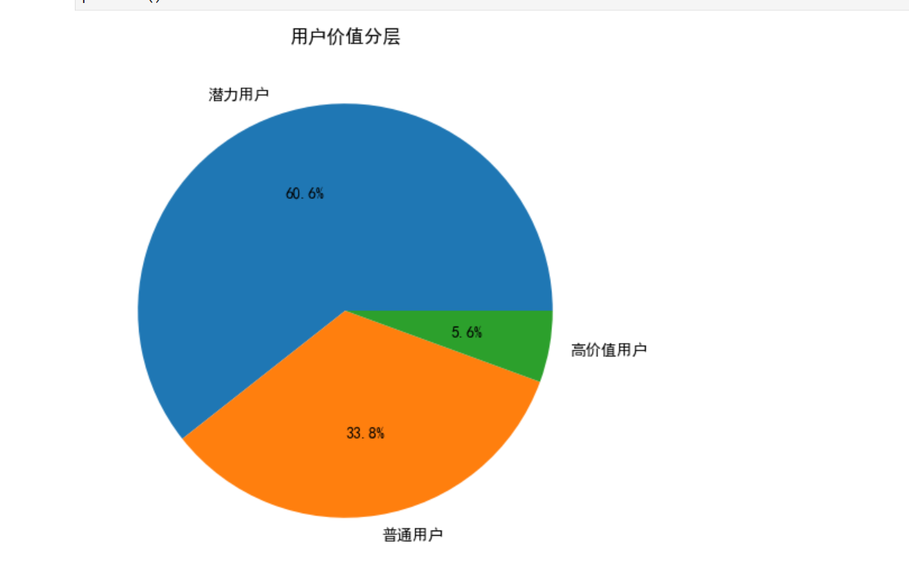

# 🛒 电商用户行为分析（E-commerce User Behavior Analysis）

> 基于约 1 亿条真实电商用户行为数据，完成数据清洗、用户价值分层与商品热度分析，并通过 Streamlit 构建交互式可视化仪表盘。


## ✨ 项目简介

本项目基于公开的电商用户行为数据集（UserBehavior，约 1 亿条浏览、收藏、加购、购买记录），探索用户从浏览到购买的转化路径：

- 按行为类型聚合数据，还原用户转化漏斗；
- 构建用户行为评分模型，完成**高价值 / 潜力 / 普通**用户分层；
- 分析热门商品 Top 10 与浏览量分布；
- 使用 Streamlit 搭建交互式仪表盘，直观展示关键指标与洞察。

## 📊 效果预览







## ⚙️ 技术栈

| 类别 | 工具 |
| --- | --- |
| 语言 | Python 3.10+ |
| 数据处理 | pandas / numpy |
| 可视化 | matplotlib / seaborn / Plotly |
| 分析工具 | Jupyter Notebook |
| 交互应用 | Streamlit |

## 🔄 项目架构

```text
原始行为数据（约 1 亿条：pv / fav / cart / buy）
        │
        ▼
数据清洗与聚合（行为计数 / 用户维度特征）
        │
        ▼
用户价值分层（评分模型 → 高价值 / 潜力 / 普通）
        │
        ▼
商品热度分析（浏览量 Top 10）
        │
        ▼
Streamlit Dashboard（关键指标 / 转化漏斗 / 可视化）
```

## 📁 项目结构

```text
E-commerce-analysis/
├── data/
│   ├── behavior_count.csv     # 行为汇总数据（已提交）
│   ├── top10_items.csv        # 热门商品 Top 10（已提交）
│   ├── user_profile.csv       # 用户画像（大数据，已忽略）
│   └── UserBehavior.csv       # 原始行为数据（大数据，已忽略）
├── notebook/
│   └── analysis.ipynb         # 数据分析与处理流程
├── dashboard/
│   └── app.py                 # Streamlit 仪表盘
├── images/                    # 分析图表
└── requirements.txt
```

## 🚀 快速开始

```bash
# 1. 安装依赖
pip install -r requirements.txt

# 2. 启动仪表盘
streamlit run dashboard/app.py
```

仪表盘会自动读取 `data/behavior_count.csv` 与 `data/top10_items.csv`。如需完整复现分析过程，将原始数据放入 `data/` 目录后运行 `notebook/analysis.ipynb` 即可重新生成。

> 原始数据体积较大（GB 级），已通过 `.gitignore` 排除，不会提交到 GitHub。

## 📈 关键指标（基于汇总数据）

| 指标 | 数值 |
| --- | --- |
| 总行为次数 | 约 1.00 亿 |
| 浏览 → 购买转化率 | 约 2.25% |
| 加购 → 购买转化率 | 约 36.45% |
| 高价值用户 | 595,606 人 |
| 潜力用户 | 322,067 人 |
| 普通用户 | 70,321 人 |

## 💡 核心洞察

- 浏览是用户购买路径的最大入口，但浏览 → 购买转化率仅约 2.25%，大部分流量未转化为购买；
- 加购 → 购买转化率约 36.45%，**加购是强购买信号**；
- 用户价值呈金字塔结构，高价值用户（约 60 万）是精细化运营的重点人群。

## 📋 数据格式

`data/behavior_count.csv`：

| 字段 | 说明 |
| --- | --- |
| behavior | 行为类型：`pv`、`fav`、`cart`、`buy` |
| count | 对应行为的总次数 |

`data/top10_items.csv`：

| 字段 | 说明 |
| --- | --- |
| item_id | 商品 ID |
| pv_count | 商品浏览次数 |

## 🎯 后续规划

- [ ] 增加用户行为时序分析（RFM 模型）
- [ ] 补充商品组合与关联推荐分析
- [ ] 增加转化率的同环比趋势对比

## 📄 License

[MIT](LICENSE)
